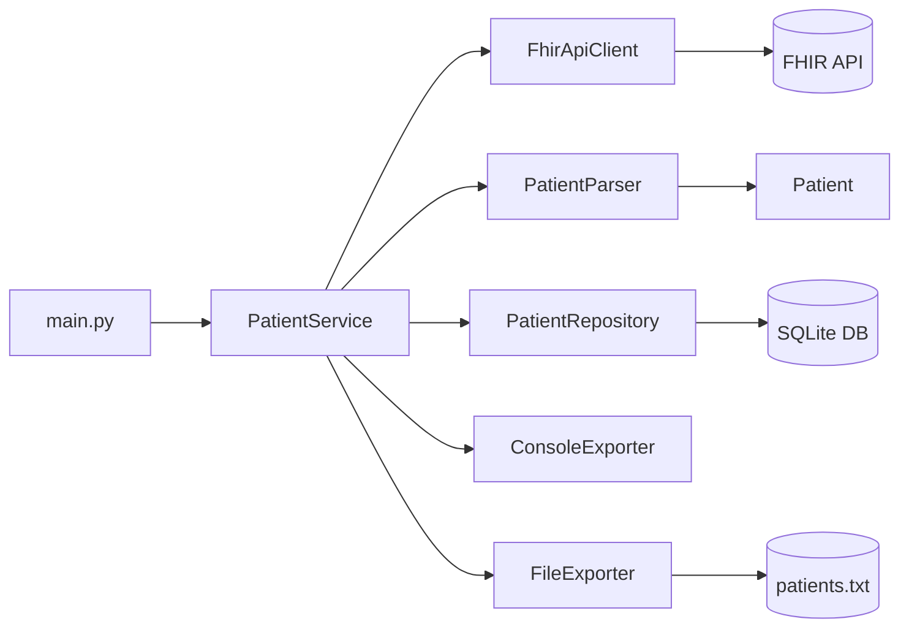
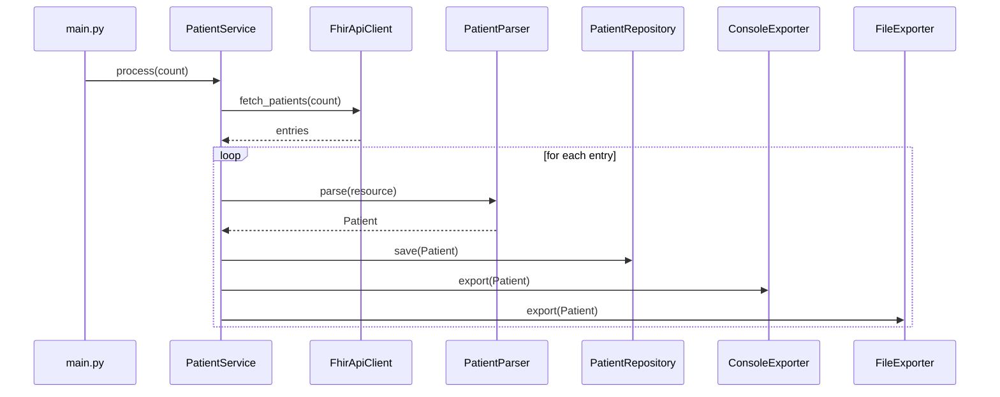

# Healthcare App (FHIR Patient Import)

Python app that pulls patient data from a public FHIR server, parses it,
stores it in SQLite, and exports a summary to console and text file.

## What It Does
- Fetches patients from `https://r4.smarthealthit.org` (FHIR R4 demo server)
- Parses patient name, birth date, and gender
- Saves patients to SQLite
- Appends `patient_id,name` to a text file
- Prints patient summaries to console logs

## Project Structure
```text
healthcare_project/
|
+-- src/
|   +-- healthcare/
|       +-- __init__.py
|       +-- api/
|       |   +-- fhir_client.py
|       +-- models/
|       |   +-- patient.py
|       +-- parsers/
|       |   +-- patient_parser.py
|       +-- repository/
|       |   +-- patient_repository.py
|       +-- services/
|       |   +-- patient_service.py
|       +-- exporters/
|       |   +-- base.py
|       |   +-- console_exporter.py
|       |   +-- file_exporter.py
|       +-- config/
|       |   +-- settings.py
|       |   +-- config.yml
|       +-- utils/
|           +-- logger.py
|
+-- tests/
|   +-- unit/
|   |   +-- test_api_fhir_client.py
|   |   +-- test_patient_model.py
|   |   +-- test_patient_parser.py
|   |   +-- test_patient_service.py
|   +-- integration/
|       +-- test_patient_pipeline.py
|
+-- main.py
+-- pytest.ini
+-- requirements.txt
```

## Architecture Diagram


## Runtime Flow


## Requirements
- Python 3.10+
- `requests`
- `PyYAML`
- `pytest` (for tests)

Install dependencies:
```bash
pip install -r requirements.txt
```

## Setup (Windows PowerShell)
```powershell
python -m venv .venv
.\.venv\Scripts\Activate.ps1
pip install -r requirements.txt
```

If script execution is blocked:
```powershell
Set-ExecutionPolicy -Scope CurrentUser -ExecutionPolicy RemoteSigned
```

## Run
```bash
python main.py
```

## Test
Run all tests:
```bash
python -m pytest -q
```

Run only unit tests:
```bash
python -m pytest tests/unit -q
```

Run only integration tests:
```bash
python -m pytest tests/integration -q
```

## Output Files
- DB path from `src/healthcare/config/config.yml` (`database.path`)
- Export file path from `FILE_PATH` env var or default `patients.txt`

## Notes
- `main.py` adds `src` to `sys.path` so `healthcare.*` imports work when running directly.
- `pytest.ini` sets `pythonpath = src` for test discovery/imports.
- Public FHIR APIs can be rate-limited or temporarily unavailable.
